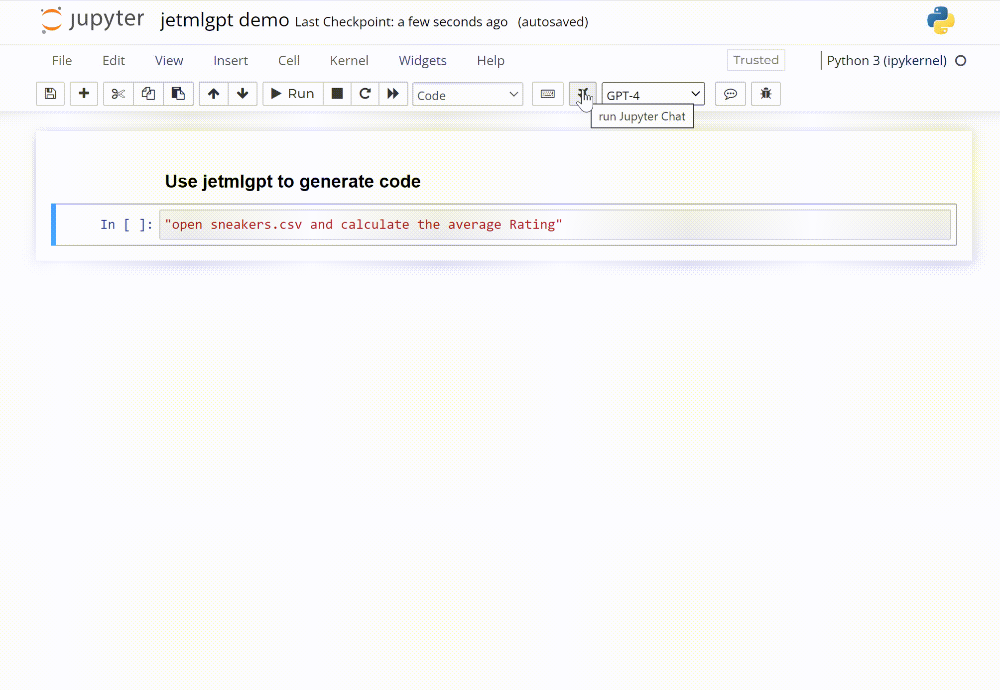
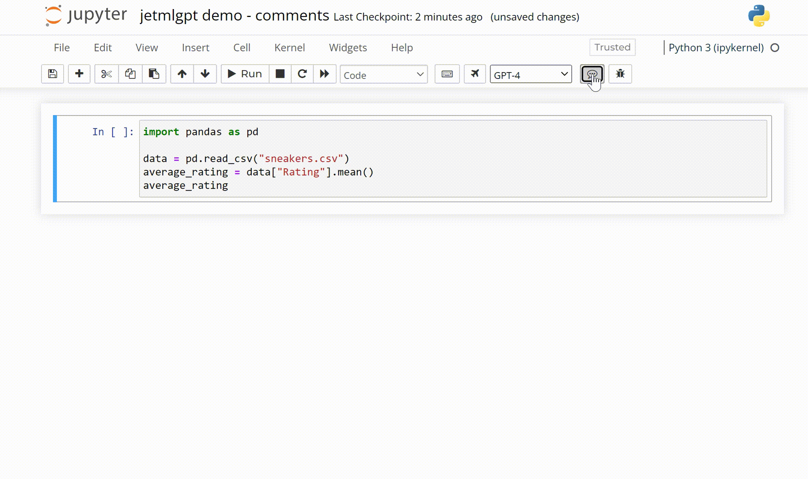

# JetMLGPT

JetMLGPT is a Jupyter extension that brings the power of OpenAI's ChatGPT and GPT4 to your Jupyter notebooks. It helps you with auto-completing, commenting, and debugging code within your Jupyter notebook environment.

## Features

* Auto-complete code in Jupyter notebooks using ChatGPT and GPT4
* Generate minimal comments for the provided code
* Debug and fix errors in your code

## Installation

To install the JetMLGPT extension, simply run the following command and restart jupyter:

```
pip install jetmlgpt
jupyter serverextension enable --py jetmlgpt
```

## Usage

First, set your OpenAI API key in the environment variable `OPENAI_API_KEY` to activate the extension.

Then, launch your Jupyter notebook, and you'll find the following buttons:

1. "Run Jupyter Chat": Use this button to auto-complete the code in the selected cell.

2. "Add Comment": Use this button to generate a minimal comment for the provided code.

3. "Fix Error": Use this button to debug and fix errors in your code, based on the input and output of the selected cell.


You can also choose between the GPT-3.5 Turbo and GPT-4 models using the dropdown menu.

## Documentation

For more information about JetMLGPT, please visit our website at [https://jetml.com](https://jetml.com) (hosted options available)

You can also check out the source code and contribute to the project on GitHub: [https://github.com/jetml/jetmlgpt](https://github.com/jetml/jetmlgpt).

## License

JetMLGPT is licensed under the Apache Software License. For more information, please refer to the [LICENSE](LICENSE) file.

## Important

Do not share sensitive notebooks and data with OpenAI.
